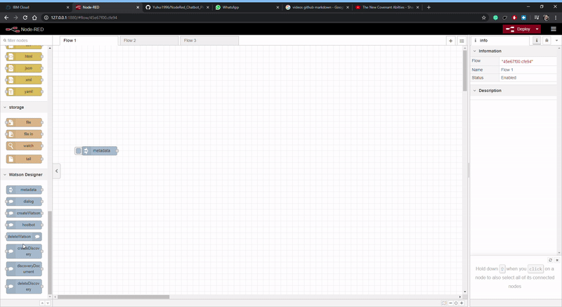

# Delete Watson Node 

## Visual 

            

## Components
This is a relatively simple module. The HTML is the frontend and js is backend. 

##### HTML 
The HTML contains the following components

* Holds little other than formatting

##### JS 

The JS file deletes the assistant on the backend doing the following: 

* Takes chatbot name from metadata node
* Searches workspaces on given URL and delete all with matching name.

## Tutorial

1) Copy the node onto the flow.
2) Connect node to metadata node 
3) The node is now ready, deploy and click the metadata button to activate!

## Notes
Originally we were considering merging the code from this node into the metadata node. However we 
decided against that so that it becomes easier to separate create and delete workspaces with a seperate delete node.
## Requirements
* ibm-watson
* jQuery
* fs
* path