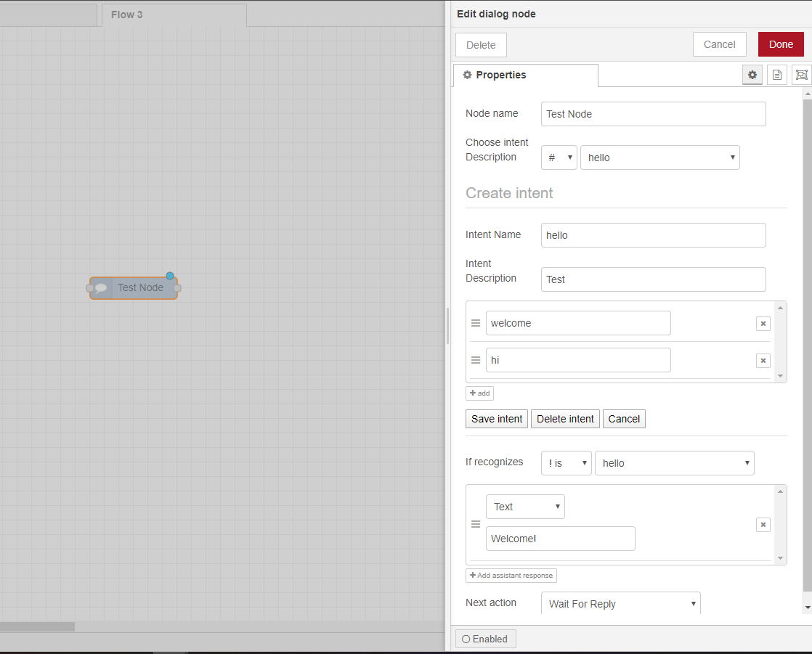
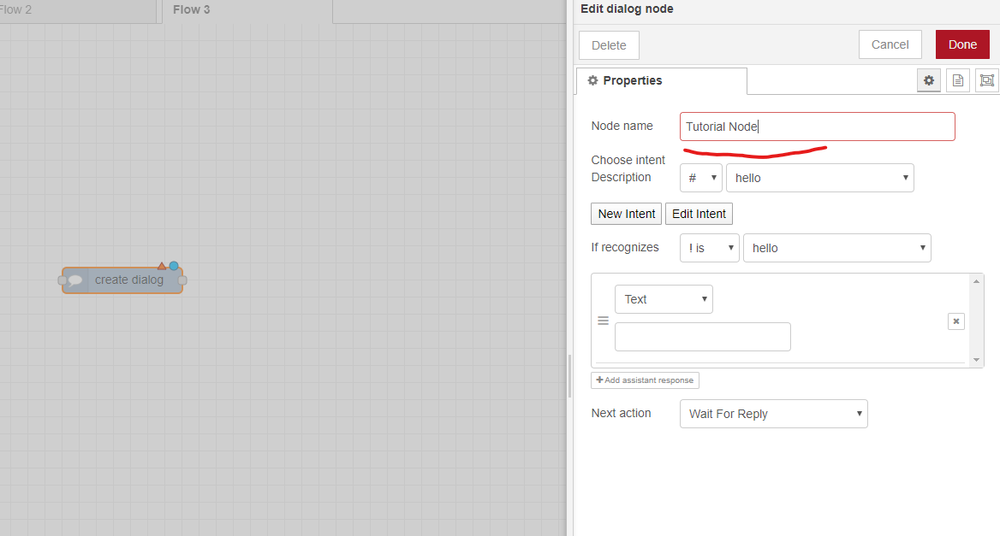
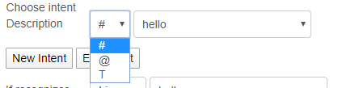
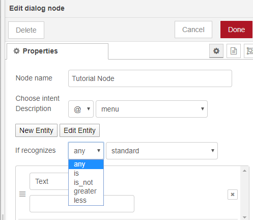
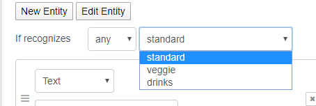
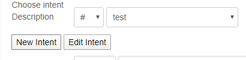
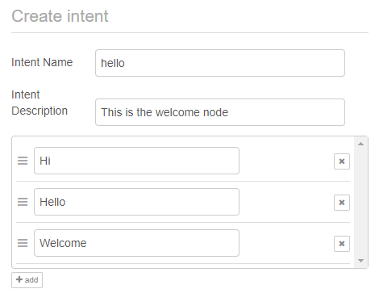
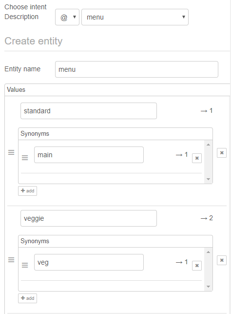
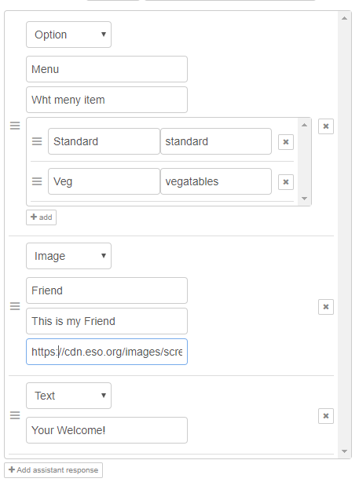
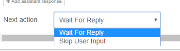

# Dialog node documentation
This node is the main components of the chatbot's dialog tree. Each node refers to one input and reply given by
the user and replied by the chatbot. This however, is customisable and thus can be changed as will be demonstrated 
below. 
## Overview
This is one of the core nodes of the system. It is what makes up the dialog tree, which is the 
structure of the interactions of the chatbot. This readme is both a tutorial for this node as well as 
more information for developers to understand the code-base. 

## Visuals

  

## Components
#### HTML File

The html file contains the largest part of the codebase. This file manages the front end of the dialog node. This
includes the following components: 

* Create Intents and entities 
* Edit Intents and Entities 
* Delete Intents and Entities 
* Choose matching to entity or intent or true value
* Choose matching to entity values if entity selected
* Choose response to match in dialog, include:
    * Text response
    * Image response
    * Option Response
* Choosing what the chatbot should do before moving to child nodes. Namely if the chatbot should wait for a user reply or 
go directly to the child nodes.

#### JS file
The JS file runs on the server side. This captures the data from the frontend on deployment and creates the dialog node
on the backend via the API Call. When the Node is activated it performs the following in this order:

1) Create API credentials
2) Create Unique ID of node
3) Build the API parameters
    * This includes capturing the all data from the front end variables
4)Create the API call with parameters and pass to Promise Queue Script. When promise executes then send data to child nodes.
 
## Tutorial
This is a overview of how to use this node for the user to follow. This tutorial is ___ steps:

##### Step 1) Create the node
* Drag the dialog node from the plugin and open the node editing box by double clicking on it.
* Name the node.
##### Step 2) Set up the recognition system
* Choose if you would like to use an intent (#), Entity (@) or True (T) value.
    * Intents are actions or requests that the chabot can respond too.
    * Entities are the nouns or options that can be chosen. Entities have a list of values within them.
    * True is a default value. This node is activated when the user input is not recognised. 
    * 
* Select the specific entity or intent
    * if one doesnt exist, view step 3
    * 
* If using an entity select the matching value. Note that "greater" and "less" matching parameters require numeric values. 
    * 
    * 
* You now have you selection criteria.

##### Step 3) Creating, editing and deleting nodes
Firstly, before talking about these. Please not that entities and intents are global. Hence, if they are changed in one
node they will change in the others.
###### Intent
1) If you would like to create a new intent, select the intent option (#) and click "create intent".
     * 
2) Fill in the name (which must have no spaces) and the description.
3) Fill in the examples. These are examples of what the user might say to activate this intent.
    * There is an add button on the bottom right of the section to add more examples
    * Note these examples should never be the same as it will lead to less accurate responses from the chatbot.
    * 
4) Click save

1) If you would like to edit the intent or delete intent first select the intent.
2) Then, as with creation edit the variables and click save.
3) To delete, simply open the editing page and click delete! 

###### Entity
1) If you would like to create a new entity, select the intent option (@) and click "create entity".
2) Fill in the name (which must have no spaces) and the description.
3) As before once can then fill in the values. However, with entities this is somewhat different. 
    * Entities have a set of values. Think of them as options.
    * Each value has a set of synonyms. This is similar to the examples of intents.
    * Fill in the values and synonyms you desire. 
    * 
4) Click save

1) If you would like to edit the intent or delete entity first select the entity.
2) Then, as with creation edit the variables and click save.
3) To delete, simply open the editing page and click delete! 

##### Step 4) Responses
Filling in the responses is fairly straight forwards. There are three options: Text, options and images. They are described
below. To have multiple responses simply click the add button at the bottom of the section:

1) Text: Simple select the text option and type a response. 
2) Image: 
    * Fill in the title
    * Fill in the description (Note this will be desplayed in the chat)
    * copy the link to the image into the URL box (Note this must be hosted online somewhere)
3) Option:
    * Fill in the title
    * Fill in the description
    * In the dynamic box, add options. Node for each option there are two entries. The first is the option that the user
    will see and the second is the corresponding matching value that will be used in the child nodes.
    
    

##### Step 5) Next Action
Here the user can select if the chatbot must wait for user input before going to child nodes in the tree. 
If the designer decided to skip user input, then the chatbot will search the entered text for the parent node again.

This would work for example if the user asks "I would like the standard menu please". This would activate the menu intent
and the standard menu entity value child node. 

##### Step 6) Linking
The node is now ready to be linked to other nodes. Note this node must be linked to either a "CreateWatson" node or 
other dialog node. 

Linking order is also important, especially if you have a default node ("true"). The nodes are searched in reverse order
to how they are connected. Hence, a default node should always be connected first to any parent node
, thereafter the order shouldn't matter too much.

## Future dev

This modules has the largest room for expansion in future development. Only the essential components of the dialog node 
have been implemented in the proof of concept. Hence, in the future this coold be expanded for a more broad range of tasks.
For example: 
* Web sockets
* Variable saving 
* Implementation of none generic response types 
* Slots 
* Diverging

These should all be fairly easy to implement based on the structure of the current PoC

## Requirements 
* ibm-watson
* queue script
* jQuery

