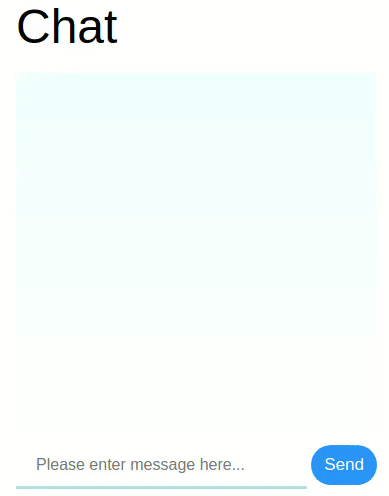
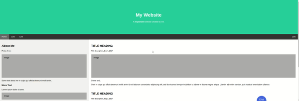

# Hostbot
The purpose of this custom node is to generate a url link and open a new tab which navigates to a webpage that 'host' the created chatbot.

## Visuals
<p align="center">
  
  <br>
  Chatbot window
</p>
<br>

<p align="center">
  
  Chatbot as widget on website
</p>

## Usage
It needs be connected to the metanode (with api key and url included), or create_watson so that it will automatically choose the created workspace.

To query/chat to the dicovery function, a Dialog node must connect to a Discovery environment node. The chatbot will give the user reply from discovery instead of the replay from that Dialog node. Please see example below.

<p align="center">
  
</p>

The msg.payload of this node contains the snip of the chatbot widget which can be inserted into webpages. It can be viewd by connectting a node just as debug to output the code.

## Dependency
- [open](https://www.npmjs.com/package/open)
- [connect](https://www.npmjs.com/package/open)
- [serve-static](https://www.npmjs.com/package/serve-static)
- [ngrok](https://www.npmjs.com/package/ngrok)
- [detect-port](https://www.npmjs.com/package/detect-port)

if you have difficulties installing ngrok dependency please use:
```
sudo npm i -g ngrok --unsafe-perm=true --allow-root
```

### Note
Currently the webpage provides no security to the api key at all as every api calls to watson is done through client side js.
