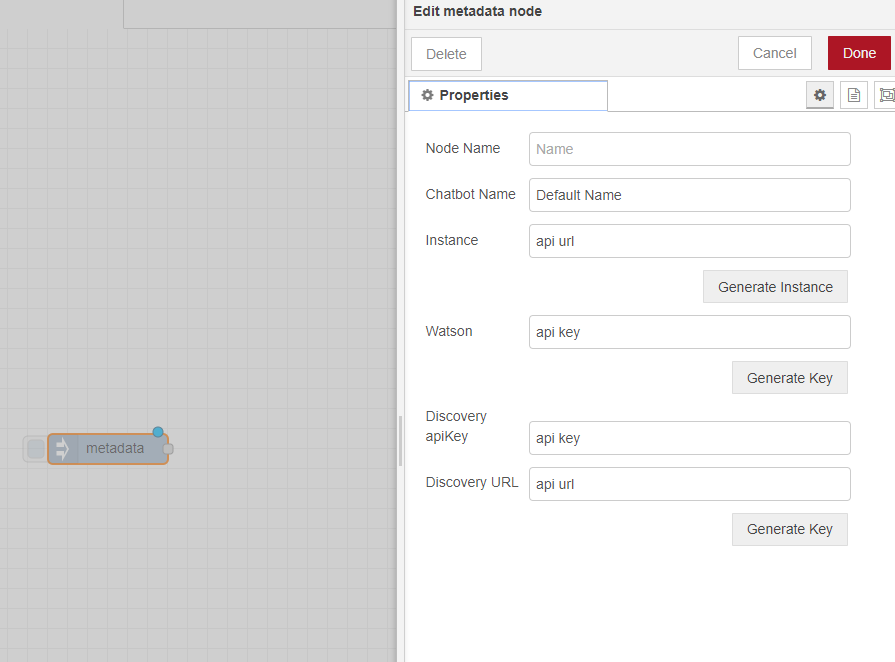

# Metadata Node 
The metadata node is the node at the top of the node-red tree. It contains all important connection information 
for the other nodes. The information that is added here must be created from an IBM cloud account.

## Visual 

            

## components
This is a relatively simple module. The HTML is the frontend and js is backend. 

##### HTML 
The HTML contains the following components

* Chatbot name 
* Watson Assistant API and URL Entry points 
* Watson Discovery API and URL Entry Points

##### JS 

The JS file simply create the API object for Assistant and send the data down the tree/

## Tutorial

1) Copy the node onto the flow.
2) Double click the node to edit it
3) Copy paste API data into the relative nodes.
4) click done to save data

#### Getting API URL and KEYs

1) Open IBM cloud and login
2) Click the menu on the top left and scroll down to watson. Click on it. 
3) Under "Watson Services" click "Browse Services"
4) Select Assistant or Discovery 
5) Create your instance with a valid plan
    * note free plans for discovery and assistant can limit the system
    * For example, if you use the basic assistant plan. You can only have 5 different instances of
    a chatbot and if you make another without deleting the old one it will throw and error.
    * Another example is the basic Discovery only allows on instance so the old one will always need to 
    be deleted. 
6) Copy Paste the API Key and URL into Node-RED 

## Limitations
Due to limitations on the API side we cannot auto generate these keys and thus they must be copied. 
Hopefully in the future these can be implemented.

## Future Dev
Future development would allow for more APIs to be implemented through this system as once the keys are added here they 
can be passed around the entire system. Hence, this structure of system can lead to great future development.

## Requirements
* ibm-watson
* jQuery